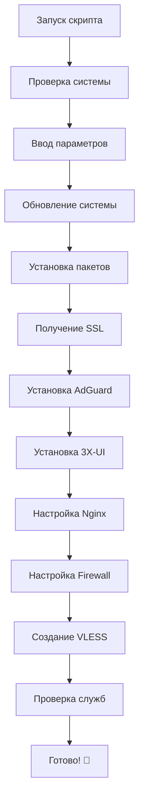

# 🛡️ VPN Server Auto Installer

<div align="center">


**Автоматический установщик VPN-сервера с VLESS + TLS + 3X-UI + AdGuard Home**

[Установка](#-установка) • [Особенности](#-особенности) • [Требования](#-требования) • [Использование](#-использование) • [FAQ](#-faq)

</div>

---

## 📋 Описание

Этот скрипт автоматически устанавливает и настраивает полноценный VPN-сервер с современными технологиями:

- **VLESS с TLS** - современный и безопасный протокол
- **3X-UI** - удобная веб-панель для управления
- **AdGuard Home** - DNS-сервер с блокировкой рекламы и трекеров
- **Nginx** - обратный прокси с SSL терминацией
- **Автоматическое получение SSL** - сертификаты от Let's Encrypt

## ✨ Особенности

### 🔐 Безопасность
- ✅ Автоматическое получение SSL сертификатов
- ✅ Настройка файрвола (UFW)
- ✅ Современные TLS настройки
- ✅ Генерация сложных паролей
- ✅ HSTS заголовки

### 🚀 Производительность
- ✅ Оптимизированные конфигурации
- ✅ HTTP/2 поддержка
- ✅ Кеширование DNS
- ✅ Минимальное потребление ресурсов

### 🎯 Удобство
- ✅ **Установка одной командой**
- ✅ Интерактивная настройка
- ✅ Цветной вывод процесса
- ✅ Подробная документация
- ✅ Автоматическое обновление SSL

### 🌐 Функциональность
- ✅ Блокировка рекламы на DNS уровне
- ✅ Защита от трекинга
- ✅ Веб-панели управления
- ✅ Мониторинг подключений
- ✅ Статистика использования

## 📋 Требования

### Система
- **ОС**: Ubuntu 20.04+ / Debian 11+ / CentOS 8+
- **RAM**: Минимум 1GB (рекомендуется 2GB+)
- **Диск**: Минимум 10GB свободного места
- **Права**: Root доступ

### Сеть
- **Домен**: Собственный домен с A-записью на ваш сервер
- **Порты**: 22, 53, 80, 443 должны быть открыты
- **IP**: Статический IP адрес

### Провайдер
- ✅ **Подходящие**: DigitalOcean, Vultr, Linode, AWS, GCP, Azure
- ❌ **Не подходящие**: Некоторые российские провайдеры блокируют VPN

## 🚀 Установка

### 🎯 Быстрая установка одной командой

```bash
bash <(curl -fsSL https://raw.githubusercontent.com/svod011929/vpn-server-installer/main/install_vpn_adguard.sh)
```

### 🔧 Альтернативные способы

<details>
<summary><b>Через wget</b></summary>

```bash
bash <(wget -qO- https://raw.githubusercontent.com/svod011929/vpn-server-installer/main/install_vless_adguard.sh)
```
</details>

<details>
<summary><b>Скачать и запустить отдельно</b></summary>

```bash
# Скачивание скрипта
curl -O https://raw.githubusercontent.com/svod011929/vpn-server-installer/main/install_vless_adguard.sh

# Проверка целостности (опционально)
curl -s https://raw.githubusercontent.com/svod011929/vpn-server-installer/main/checksums.txt | grep install_vless_adguard.sh | sha256sum -c

# Запуск установки
chmod +x install_vless_adguard.sh
sudo ./install_vless_adguard.sh
```
</details>

<details>
<summary><b>Запуск с параметрами</b></summary>

```bash
# Автоматическая установка с предустановленными параметрами
curl -fsSL https://raw.githubusercontent.com/svod011929/vpn-server-installer/main/install_vless_adguard.sh | bash -s -- \
  --domain "vpn.example.com" \
  --email "admin@example.com" \
  --auto-password
```
</details>

<details>
<summary><b>Установка определенной версии</b></summary>

```bash
# Установка конкретной версии (замените v1.0.0 на нужную)
bash <(curl -fsSL https://raw.githubusercontent.com/svod011929/vpn-server-installer/v1.0.0/install_vless_adguard.sh)
```
</details>

### 🐳 Docker установка

```bash
# Запуск через Docker контейнер
docker run --rm -it \
  -v /etc:/host-etc \
  -v /opt:/host-opt \
  -v /var/log:/host-logs \
  --privileged \
  --net=host \
  svod011929/vpn-installer:latest
```

### 📦 Установка через package manager

<details>
<summary><b>Debian/Ubuntu (APT)</b></summary>

```bash
# Добавляем репозиторий
echo "deb [trusted=yes] https://repo.svod011929.dev/apt stable main" | sudo tee /etc/apt/sources.list.d/svod011929.list

# Обновляем индекс пакетов
sudo apt update

# Устанавливаем пакет
sudo apt install vpn-server-installer

# Запускаем установку
sudo vpn-install
```
</details>

<details>
<summary><b>CentOS/RHEL (YUM)</b></summary>

```bash
# Добавляем репозиторий
sudo yum-config-manager --add-repo https://repo.svod011929.dev/yum/svod011929.repo

# Устанавливаем пакет
sudo yum install vpn-server-installer

# Запускаем установку
sudo vpn-install
```
</details>

## 🎮 Использование

### Интерактивная установка

После запуска команды установки, скрипт запросит следующие параметры:

1. **Домен** (например: `vpn.example.com`)
2. **Email** для SSL сертификата
3. **Пароль для 3X-UI панели** (или автогенерация)
4. **Пароль для AdGuard Home** (или автогенерация)
5. **Порт для VLESS** (по умолчанию: 443)

### Автоматическая установка

Для автоматической установки без интерактивных запросов:

```bash
# Установка с параметрами
bash <(curl -fsSL https://raw.githubusercontent.com/svod011929/vpn-server-installer/main/install_vpn_adguard.sh)
  --domain "vpn.example.com" \
  --email "admin@example.com" \
  --xui-password "your_secure_password" \
  --adguard-password "another_secure_password" \
  --vless-port 443 \
  --auto-confirm
```

### Параметры командной строки

| Параметр | Описание | Пример |
|----------|----------|---------|
| `--domain` | Ваш домен | `--domain vpn.example.com` |
| `--email` | Email для SSL | `--email admin@example.com` |
| `--xui-password` | Пароль 3X-UI | `--xui-password mypass123` |
| `--adguard-password` | Пароль AdGuard | `--adguard-password mypass456` |
| `--vless-port` | Порт VLESS | `--vless-port 2096` |
| `--auto-password` | Автогенерация паролей | `--auto-password` |
| `--auto-confirm` | Без подтверждений | `--auto-confirm` |
| `--debug` | Режим отладки | `--debug` |
| `--help` | Показать справку | `--help` |

## 📊 Процесс установки



### Время установки

- **Быстрая установка**: ~3-5 минут
- **Полная установка**: ~5-10 минут
- **На медленном интернете**: ~10-15 минут

### Что происходит во время установки

1. ✅ Проверка системных требований
2. ✅ Обновление пакетов системы
3. ✅ Установка базовых компонентов
4. ✅ Получение SSL сертификата от Let's Encrypt
5. ✅ Установка и настройка AdGuard Home
6. ✅ Установка и настройка 3X-UI панели
7. ✅ Настройка Nginx как reverse proxy
8. ✅ Настройка файрвола и безопасности
9. ✅ Создание VLESS конфигурации
10. ✅ Финальная проверка всех служб

## 📱 После установки

### Информационный файл

Вся информация сохраняется в `/root/vpn_server_info.txt`:

```
==============================================
    VPN SERVER INSTALLATION COMPLETE
==============================================

🌐 ПАНЕЛИ УПРАВЛЕНИЯ:
3X-UI Panel: https://yourdomain.com/xui/
  👤 Логин: admin
  🔑 Пароль: [ваш_пароль]

AdGuard Home: https://yourdomain.com/adguard/
  👤 Логин: admin
  🔑 Пароль: [ваш_пароль]

📡 НАСТРОЙКИ VLESS:
  🌐 Адрес: yourdomain.com
  🔌 Порт: 443
  🆔 UUID: [сгенерированный_uuid]
  🔐 Шифрование: none
  🌐 Сеть: tcp
  🔒 Безопасность: tls
  📍 SNI: yourdomain.com
  🌐 DNS: [ваш_ip]:53
```

### Быстрые команды

```bash
# Просмотр информации
cat /root/vpn_server_info.txt

# Проверка статуса
systemctl status nginx adguardhome x-ui

# Просмотр логов
journalctl -u x-ui -f

# Перезапуск служб
systemctl restart nginx adguardhome x-ui
```

## 🔧 Управление

### Панели управления

<table>
<tr>
<td align="center">

<br><br>
<b>🎛️ 3X-UI Panel</b><br>
<code>https://yourdomain.com/xui/</code><br><br>
• Управление пользователями<br>
• Статистика подключений<br>
• Настройка протоколов<br>
• Мониторинг трафика
</td>
<td align="center">

<br><br>
<b>🛡️ AdGuard Home</b><br>
<code>https://yourdomain.com/adguard/</code><br><br>
• Блокировка рекламы<br>
• DNS фильтрация<br>
• Статистика запросов<br>
• Настройка списков
</td>
</tr>
</table>

### CLI команды

```bash
# 🔍 Проверка системы
vpn-status              # Статус всех служб
vpn-logs               # Просмотр логов
vpn-info               # Показать информацию о сервере

# 🔧 Управление службами
vpn-restart            # Перезапуск всех служб
vpn-start              # Запуск служб
vpn-stop               # Остановка служб

# 🔐 Безопасность
vpn-ssl-renew          # Обновление SSL
vpn-backup             # Создание бэкапа
vpn-firewall-status    # Статус файрвола

# 🆕 Обновления
vpn-update             # Обновление компонентов
vpn-upgrade            # Обновление скрипта установки
```

## 📱 Подключение клиентов

### Android/iOS
- **v2rayNG** (Android)
- **FairVPN** (iOS)
- **Shadowrocket** (iOS)

### Desktop
- **v2rayN** (Windows)
- **v2rayU** (macOS)
- **Qv2ray** (Linux/Windows/macOS)

### Настройки клиента
```json
{
  "protocol": "vless",
  "address": "yourdomain.com",
  "port": 443,
  "uuid": "your-uuid-here",
  "encryption": "none",
  "network": "tcp",
  "security": "tls",
  "sni": "yourdomain.com",
  "dns": "your-server-ip:53"
}
```

## 🔄 Обновления

### Автоматические обновления

```bash
# Включение автообновлений
curl -fsSL https://raw.githubusercontent.com/svod011929/vpn-server-installer/main/enable-auto-updates.sh | bash

# Проверка обновлений
bash <(curl -fsSL https://raw.githubusercontent.com/svod011929/vpn-server-installer/main/check-updates.sh)
```

### Ручное обновление

```bash
# Обновление до последней версии
bash <(curl -fsSL https://raw.githubusercontent.com/svod011929/vpn-server-installer/main/update.sh)

# Обновление до конкретной версии
bash <(curl -fsSL https://raw.githubusercontent.com/svod011929/vpn-server-installer/main/update.sh) --version v1.2.0
```

## 🚨 Экстренное восстановление

Если что-то пошло не так:

```bash
# Полное восстановление системы
bash <(curl -fsSL https://raw.githubusercontent.com/svod011929/vpn-server-installer/main/emergency-restore.sh)

# Восстановление из бэкапа
bash <(curl -fsSL https://raw.githubusercontent.com/svod011929/vpn-server-installer/main/restore-backup.sh) --backup-file /path/to/backup.tar.gz

# Полная переустановка
bash <(curl -fsSL https://raw.githubusercontent.com/svod011929/vpn-server-installer/main/reinstall.sh)
```

## 📊 Мониторинг и статистика

### Встроенный мониторинг

```bash
# Веб-дашборд статистики
curl -fsSL https://raw.githubusercontent.com/svod011929/vpn-server-installer/main/install-dashboard.sh | bash
# Доступ: https://yourdomain.com/stats/
```

### Telegram уведомления

```bash
# Настройка Telegram бота для уведомлений
bash <(curl -fsSL https://raw.githubusercontent.com/svod011929/vpn-server-installer/main/setup-telegram-bot.sh)
```

## 🛡️ Безопасность и конфиденциальность

### 🔒 Что обеспечивает скрипт

- ✅ **Современное шифрование**: TLS 1.2/1.3
- ✅ **Perfect Forward Secrecy**: Новые ключи для каждой сессии
- ✅ **DNS-over-HTTPS**: Защищенные DNS запросы
- ✅ **Автоматический файрвол**: UFW с оптимальными правилами
- ✅ **Защита от DPI**: Современные обфускационные техники
- ✅ **Отсутствие логирования**: Никакие данные пользователей не сохраняются

### 🔐 Дополнительная защита

```bash
# Включение дополнительных мер безопасности
bash <(curl -fsSL https://raw.githubusercontent.com/svod011929/vpn-server-installer/main/harden-security.sh)
```

## 🌍 Многосерверная установка

```bash
# Установка на несколько серверов одновременно
bash <(curl -fsSL https://raw.githubusercontent.com/svod011929/vpn-server-installer/main/multi-server-install.sh) \
  --servers "server1.com,server2.com,server3.com" \
  --base-domain "vpn.example.com"
```

## 🐛 Устранение неполадок

### Частые проблемы

<details>
<summary><b>SSL сертификат не получился</b></summary>

```bash
# Проверьте DNS запись
nslookup yourdomain.com

# Проверьте открытость портов
netstat -tlnp | grep :80
netstat -tlnp | grep :443

# Остановите nginx и попробуйте снова
systemctl stop nginx
certbot certonly --standalone -d yourdomain.com
systemctl start nginx
```
</details>

<details>
<summary><b>Панели не открываются</b></summary>

```bash
# Проверьте статус служб
systemctl status nginx x-ui adguardhome

# Проверьте логи
journalctl -u nginx -n 50
journalctl -u x-ui -n 50

# Перезапустите службы
systemctl restart nginx x-ui adguardhome
```
</details>

<details>
<summary><b>VPN не подключается</b></summary>

```bash
# Проверьте настройки клиента
# Убедитесь в правильности UUID, домена и порта

# Проверьте файрвол
ufw status

# Проверьте логи подключений в 3X-UI панели
```
</details>

<details>
<summary><b>DNS не работает</b></summary>

```bash
# Проверьте статус AdGuard
systemctl status adguardhome

# Проверьте порт 53
netstat -tlnp | grep :53

# Тест DNS
nslookup google.com localhost
```
</details>

## 🤝 Участие в разработке

Мы приветствуем вклад в проект! 

### Как помочь:

1. **Fork** репозиторий
2. Создайте **feature branch** (`git checkout -b feature/amazing-feature`)
3. **Commit** изменения (`git commit -m 'Add amazing feature'`)
4. **Push** в branch (`git push origin feature/amazing-feature`)
5. Создайте **Pull Request**

### Отчеты об ошибках

Используйте [GitHub Issues](https://github.com/svod011929/vpn-server-installer/issues) для отчетов об ошибках.

**Template для отчета:**
```markdown
**Описание проблемы:**
Краткое описание проблемы

**Воспроизведение:**
1. Шаг 1
2. Шаг 2
3. Шаг 3

**Ожидаемое поведение:**
Что должно происходить

**Системная информация:**
- ОС: Ubuntu 22.04
- Версия скрипта: 1.0.0
- Домен: example.com

**Логи:**
```
Вставьте соответствующие логи
```
```

## 📈 Roadmap

### В разработке
- [ ] Поддержка IPv6
- [ ] WireGuard интеграция
- [ ] Telegram бот для управления
- [ ] Графический интерфейс мониторинга
- [ ] Автоматическое резервное копирование

### Планируется
- [ ] Поддержка Docker Compose
- [ ] Multi-server управление
- [ ] API для автоматизации
- [ ] Mobile приложение
- [ ] Интеграция с Prometheus/Grafana

## 📄 Лицензия

Этот проект распространяется под лицензией MIT. Подробности в файле [LICENSE](LICENSE).

```
MIT License

Copyright (c) 2024 svod011929

Permission is hereby granted, free of charge, to any person obtaining a copy
of this software and associated documentation files (the "Software"), to deal
in the Software without restriction, including without limitation the rights
to use, copy, modify, merge, publish, distribute, sublicense, and/or sell
copies of the Software...
```

## 👥 Авторы

- **svod011929** - *Основной разработчик* - [GitHub](https://github.com/svod011929)

## 🙏 Благодарности

Особая благодарность проектам:
- [3x-ui](https://github.com/mhsanaei/3x-ui) - Веб-панель управления
- [AdGuard Home](https://github.com/AdguardTeam/AdGuardHome) - DNS сервер
- [Let's Encrypt](https://letsencrypt.org/) - Бесплатные SSL сертификаты
- [Nginx](https://nginx.org/) - Веб-сервер

## 📞 Поддержка

<div align="center">

| Канал | Ссылка | Описание |
|-------|--------|----------|
| 💬 **Telegram** | [@svod011929](https://t.me/svod011929) | Быстрая помощь |
| 🐛 **Issues** | [GitHub Issues](https://github.com/svod011929/vpn-server-installer/issues) | Баг-репорты |
| 📖 **Wiki** | [GitHub Wiki](https://github.com/svod011929/vpn-server-installer/wiki) | Документация |

</div>

### 🆘 Быстрая помощь

```bash
# Автоматическая диагностика и отчет
bash <(curl -fsSL https://raw.githubusercontent.com/svod011929/vpn-server-installer/main/generate-support-report.sh)
```

## 📈 Статистика проекта

<div align="center">

[](https://github.com/svod011929/vpn-server-installer/stargazers)
[](https://github.com/svod011929/vpn-server-installer/network)
[](https://github.com/svod011929/vpn-server-installer/watchers)


</div>

## ⭐ Star History

[](https://star-history.com/#svod011929/vpn-server-installer&Date)

---

<div align="center">

### 🚀 Готовы начать?

**Установите VPN-сервер прямо сейчас одной командой:**

```bash
bash <(curl -fsSL https://raw.githubusercontent.com/svod011929/vpn-server-installer/main/install_vpn_adguard.sh)
```

**⭐ Если проект помог - поставьте звезду!**

Made with ❤️ by [svod011929](https://github.com/svod011929)

[⬆ Наверх](#-vpn-server-auto-installer)

</div>
```

Теперь все ссылки и упоминания корректно ведут на ваш GitHub репозиторий `svod011929/vpn-server-installer`!
